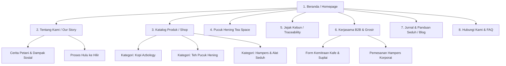

# 🌿 DOKUMEN ARSITEKTUR & PERENCANAAN WEBSITE AZBOLOGY
> **Referensi Utama:** [Agradaya.id](https://www.agradaya.id/) & Materi Katalog Resmi Azbology (`D:\azbology\Katalog Kopi AZBO-2026-Agustus.pdf`).

---

## 1. Ringkasan Eksekutif & Identitas Brand
* **Nama Brand:** AZBOLOGY (Bagian dari AZBO Group / Azalea Botanicals).
* **Tagline:** *"Dari Indonesia, Untuk Secangkir Semangat Dunia"*.
* **Filosofi & Nilai:**
  * **Pemberdayaan Petani Lokal:** Lahir dari kebutuhan petani di lereng pegunungan Temanggung (Sindoro & Sumbing) serta Kalibening Banjarnegara.
  * **Halal & Thayyib:** Mengelola kekayaan alam secara amanah, etis (*fair trade*), dan berkelanjutan.
  * **Hulu ke Hilir:** Terlibat langsung dari pembibitan, perawatan, panen (petik merah), pascapanen, roasting, hingga ke cangkir konsumen.
  * **Lini Produk:** Kopi Single Origin / Specialty & Teh Artisan (**Pucuk Hening** - *"Rasa terbaik yang lahir dari ketenangan"*).

---

## 2. Struktur Katalog Produk (Product Hierarchy)

### A. Lini Kopi (Azbology Coffee)
1. **Temanggung Fine Coffee** (Lereng Gunung Sindoro & Sumbing)
   * *Proses:* Natural Process, Honey Process, Wine / Extended Fermentation.
   * *Bentuk:* Biji Sangrai (Whole Beans), Kopi Bubuk (Fine, Medium, Coarse), Drip Bag Coffee.
2. **Kalibening Speciality Coffee** (Banjarnegara, Jawa Tengah)
   * *Proses:* Full Wash Process, Natural Process.
   * *Bentuk:* Whole Beans, Ground Coffee, Drip Bag.
3. **House Blends & Seasonal Offerings**
   * Espresso Blend (Kebutuhan Cafe/Horeca), Daily Filter Blend.

### B. Lini Teh & Tisane (Pucuk Hening - Artisan Tea)
*Filosofi: Standar pucuk daun pertama (bud & two leaves standard) yang menghadirkan ketenangan (mindful & spiritual clarity).*
1. **Teh Hitam (Black Tea Artisan):** Oksidasi penuh, kaya rasa, aroma woody/malty.
2. **Teh Hijau (Green Tea Artisan):** Tanpa fermentasi, kaya antioksidan, aroma segar rerumputan/floral.
3. **Herbal Tisane & Botanical Blends:** Racikan bunga & rempah nusantara (seperti telang, serai, jahe herbal AZBO).

### C. Paket Gift & Layanan B2B
* **Hampers & Gift Set:** Paket kombinasi Kopi + Teh Pucuk Hening + Cangkir/Tumbler.
* **B2B / Horeca Supply:** Pasokan biji kopi kiloan & teh grosir untuk kedai kopi, restoran, dan hotel.

---

## 3. Peta Situs (Website Sitemap)

---

## 4. Rincian Desain Halaman (Wireframe & Content Blocks)

### 4.1. Beranda (Homepage)
* **Hero Banner:** Foto visual sinematik kebun Sindoro/Sumbing/Kalibening dengan CTA ganda: *"Jelajahi Kopi"* & *"Temukan Ketenangan Teh"*.
* **Nilai Utama (Value Proposition):** 3 pilar: *Transparan* (Asal yang jelas), *Terarah* (Standar mutu terjaga), *Berkelanjutan* (Dampak ekonomi petani).
* **Featured Collection:** Grid produk unggulan (Temanggung Honey, Kalibening Full Wash, Teh Hitam Pucuk Hening).
* **Story Teaser:** Ringkasan narasi pemberdayaan petani dengan tombol menuju halaman *Tentang Kami*.
* **Brewing Guide / Edukasi Singkat:** Cuplikan tips menyeduh kopi & teh di rumah.
* **Integrasi WhatsApp & Marketplace:** Tombol order cepat dan tautan ke Shopee/Tokopedia resmi.

### 4.2. Halaman Produk (Product Detail Page - PDP)
* **Informasi Lengkap Spesifikasi:**
  * Kopi: *Origin, Altitude, Variety, Processing, Roast Profile, Tasting Notes*.
  * Teh: *Leaf Grade, Origin, Harvest Period, Tasting Notes, Caffeine Level*.
* **Panduan Seduh Interaktif (Brewing Guide Widget):**
  * Rekomendasi rasio air, suhu, dan waktu seduh (*steeping time / pour over steps*).
* **Opsi Pembelian Fleksibel:**
  * Pilihan ukuran (100g, 200g, 500g, 1kg) & tingkat gilingan (Biji Utuh, Halus, Sedang, Kasar).
  * Tombol **"Tambah ke Keranjang"** + Tombol instan **"Pesan Cepat via WhatsApp"**.

### 4.3. Halaman B2B & Grosir
* Penjelasan skema pasokan untuk *Coffee Shop*, hotel, dan suvenir korporat.
* Tombol unduh katalog resmi (PDF) & formulir permintaan sampel uji coba (*coffee/tea sample request*).

---

## 5. Arsitektur Teknis & Rekomendasi Teknologi

### Pilihan Opsi 1: WordPress + WooCommerce (Mengikuti Jejak Agradaya)
* **Kelebihan:** Sangat cepat diimplementasikan, mudah dikelola tim non-teknis, ekosistem plugin lokal Indonesia sangat matang.
* **Theme:** Flatsome / Astra Pro (desain responsif, clean & earthy).
* **Plugin Kunci:**
  * *WooCommerce*: Mesin toko online.
  * *OneClick WhatsApp Order*: Checkout langsung ke CS via WhatsApp.
  * *Plugin Ongkir Otomatis*: Plugin Ongkos Kirim / Woongkir (JNE, J&T, SiCepat, dll.).
  * *Payment Gateway*: Midtrans / Xendit (QRIS, VA Bank, E-Wallet).
  * *YITH WooCommerce Wishlist*: Simpan produk favorit.

### Pilihan Opsi 2: Modern Jamstack (Next.js / Nuxt + Headless Commerce)
* **Kelebihan:** Kecepatan akses ultra tinggi, desain animasi interaktif tingkat lanjut, performa SEO maksimal.
* **Tech Stack:** Next.js (App Router), Tailwind CSS, Headless Shopify / Strapi CMS.

---

## 6. Checklist Aset yang Perlu Disiapkan

1. **Aset Visual & Media:**
   * Logo Azbology (vektor/PNG transparan) & Logo Pucuk Hening.
   * Foto produk studio (packshot berlatar putih/bersih).
   * Foto *lifestyle* (seduhan kopi, cangkir teh, uap, daun kering).
   * Foto dokumentasi petani di Temanggung & Kalibening.
2. **Data & Legalitas:**
   * Izin P-IRT / Sertifikat Halal MUI/Kemenag.
   * Nomor WhatsApp Customer Service & Rekening Bank Resmi.
   * Alamat operasional resmi (Jl. Godean Km 11,5 Desa Berjo Wetan, Sleman, DIY).
3. **Copywriting & Konten:**
   * Profil lengkap masing-masing varian kopi (tasting notes & deskripsi rasa).
   * Narasi lengkap brand *Pucuk Hening*.
